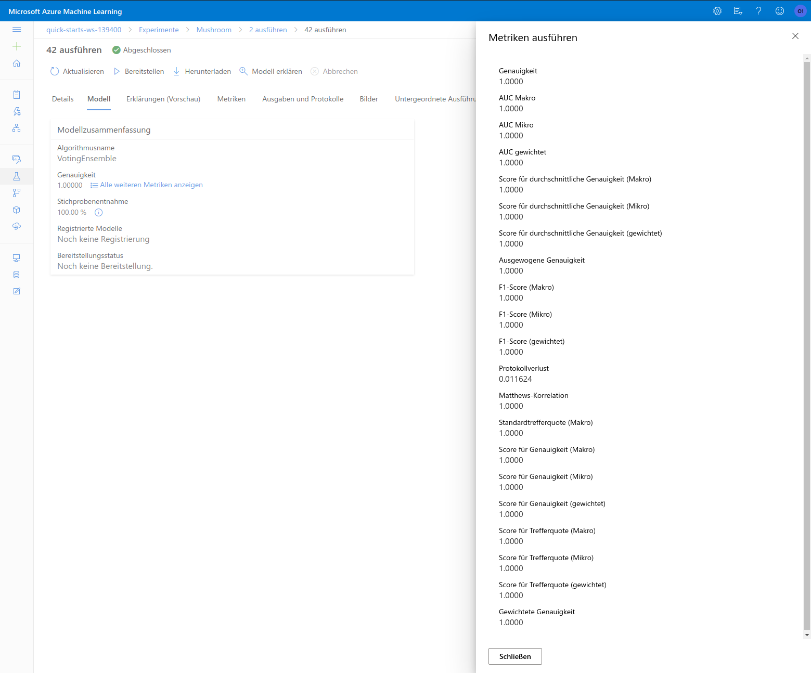

# A Mushroom classifier from the 80ies
Use an old dataset to classify the edibility of mushrooms with Azure Machine Learning


## Project Set Up and Installation

+ export the settings json to the notebook folder
+ upload all notebook files socre.py, train.py and yml files
+ run the hyperdrive notebook
+ run the automl notebook

## Dataset

### Overview
The dataset is a collection of hypothetical samples corresponding to 23 species of gilled mushrooms.
Each entry got information about cap shape, cap surface, cap color, and much more as well 
as edibility.
I found this dataset on kaggle but its was originally donated to the 
[UCI Machine Learning repository](https://archive.ics.uci.edu/ml/datasets/Mushroom)

Although the data dates back to the 80ies, I find it very useful to have a classifier to
distinguish eatable from poisonous mushrooms. This might be a real world application due
to the fact, that there is no simple rule for determining the edibility, a lot of people 
go on a mushroom foray, and some of them get mushroom poisoning.
The data for these poisoning cases is rare but there are a couple of hundred cases each year
in e.g. Germany and even some deaths related to eating mushrooms [check](https://www.aerzteblatt.de/archiv/216184/Vergiftungen-durch-Pilze).

### Task
I will use all the features in the dataset. In train.py is a clean_data method,
which will one-hot encode all categorical columns. This is needed as most machine learning 
algorithms cannot operate on categorical data directly. Is required to have input variables 
and output variables to be numeric. The one-hot encoding will solve this.

### Access
The data from UCI can be downloaded [here](https://archive.ics.uci.edu/ml/machine-learning-databases/mushroom/agaricus-lepiota.data)
the description of the set is available [here](https://archive.ics.uci.edu/ml/machine-learning-databases/mushroom/agaricus-lepiota.names).
I added a csv to this repo, to have the column names and the data in one file [here](https://raw.githubusercontent.com/mixmasteru/MLEND-capstone/main/data/mushrooms.csv)

### Import

First we register the input data as dataset in our workspace by
using Dataset.Tabular.from_delimited_files:
```python
found = False
if ds_key in ws.datasets.keys():
        found = True
        dataset = ws.datasets[ds_key]

if not found:
        # Create AML Dataset and register it into Workspace
        example_data = 'https://raw.githubusercontent.com/mixmasteru/MLEND-capstone/main/data/mushrooms.csv'
        dataset = Dataset.Tabular.from_delimited_files(example_data)
        #Register Dataset in Workspace
        dataset = dataset.register(workspace=ws,
                                   name=ds_key,
                                   description=ds_description_text)
df = dataset.to_pandas_dataframe()
df.describe()
dataset.take(5).to_pandas_dataframe()
```

### Preprocessing

In the train.py is a clean_data method which one-hot encode all Categorical data.
Some algorithms can work with categorical data, but many machine learning algorithms 
cannot operate on label data directly. They require all input variables and output 
variables to be numeric.

```python
dataframe.columns = [i.replace('-', '_') for i in dataframe.columns]
x_df = dataframe.dropna()
one_hot_cols = ['cap_shape', 'cap_surface', 'cap_color', 'odor', 'gill_spacing', 'gill_size', 'gill_color',
                'stalk_shape', 'stalk_root', 'stalk_surface_above_ring',
                'stalk_surface_below_ring', 'stalk_color_above_ring',
                'stalk_color_below_ring', 'veil_type', 'veil_color', 'ring_number',
                'ring_type', 'spore_print_color', 'population', 'habitat']

for col in one_hot_cols:
    col_one_h = pd.get_dummies(x_df.pop(col), prefix=col)
    x_df = x_df.join(col_one_h)

y_df = x_df.pop("class").apply(lambda s: 1 if s == "e" else 0)
```

## Automated ML

My primary metric is set to 'accuracy' and featurization is set to 'auto' which specifies
as part of preprocessing, data guardrails and featurization steps are to be done automatically.
I don't want to spend as much time on the process, that's why I choose a timeout of 30 minutes.
As the goal is to classify the mushrooms, I choose "classification" as "task" and "class" for label_column_name
To avoid over-fitting I set enable_early_stopping to True, with compute_target I assign the cluster for
the classification.

The `automl` settings and configuration I used for this experiment:
```python
automl_settings = {
    "experiment_timeout_minutes": 30,
    "max_concurrent_iterations": 4,
    "primary_metric" : 'accuracy',
    "featurization": 'auto'
}
automl_config = AutoMLConfig(compute_target=compute_target,
                             task = "classification",
                             training_data=x_train_data,
                             validation_data=x_test_data,
                             label_column_name="class",
                             path = project_folder,
                             enable_early_stopping= True,
                             model_explainability=True,
                             debug_log = "automl_errors.log",
                             **automl_settings
                            )
```


### Results
The RunDetails of the AutoMl triggered from the notebook.


The was not one best Model, but a lot of them like VotingEnsemble, SparseNormalizer + XGBoostClassifier and many more.


This is the list in the UI


The python call in the notebook returned MaxAbsScaler + LightGBM as best model. 
```python
'recall_score_weighted': 1.0,
'norm_macro_recall': 1.0,
'AUC_weighted': 1.0,
'f1_score_micro': 1.0,
'f1_score_weighted': 1.0,
'precision_score_macro': 1.0,
'average_precision_score_micro': 1.0,
'AUC_micro': 1.0,
'accuracy': 1.0,
'recall_score_micro': 1.0,
'average_precision_score_macro': 1.0,
'AUC_macro': 1.0,
'balanced_accuracy': 1.0,
'precision_score_micro': 1.0,
'matthews_correlation': 1.0,
'average_precision_score_weighted': 1.0,
'precision_score_weighted': 1.0,
'log_loss': 2.997299456938485e-05,
'recall_score_macro': 1.0,
'weighted_accuracy': 1.0,
'f1_score_macro': 1.0,
'confusion_matrix': 'aml://artifactId/ExperimentRun/dcid.AutoML_d359eaa0-48aa-408b-8e40-74fb6f77cad7_0/confusion_matrix',
'accuracy_table': 'aml://artifactId/ExperimentRun/dcid.AutoML_d359eaa0-48aa-408b-8e40-74fb6f77cad7_0/accuracy_table'

'datatransformer',
DataTransformer(enable_dnn=None, enable_feature_sweeping=None,
feature_sweeping_config=None,
feature_sweeping_timeout=None,
featurization_config=None, force_text_dnn=None,
is_cross_validation=None,
is_onnx_compatible=None, logger=None,
observer=None, task=None, working_dir=None)),
('MaxAbsScaler', MaxAbsScaler(copy...
LightGBMClassifier(boosting_type='gbdt', class_weight=None,
colsample_bytree=1.0,
importance_type='split', learning_rate=0.1,
max_depth=-1, min_child_samples=20,
min_child_weight=0.001, min_split_gain=0.0,
n_estimators=100, n_jobs=1, num_leaves=31,
objective=None, random_state=None,
reg_alpha=0.0, reg_lambda=0.0, silent=True,
subsample=1.0, subsample_for_bin=200000,
subsample_freq=0, verbose=-10))
```

The best model with its metrics in the UI


The confusion matrix looks perfect but no two false positives or other errors.


## Hyperparameter Tuning
I use Logistic regression as it is a very powerful algorithm and works very go for not so complex problems.
For the primary metric I used 'Accuracy' and ScriptRunConfig is used with train.py python script.
I limit the maximum runtime to 30 minutes and total runs to 30.

An important parameter to tune is "C" the inverse of regularization strength.
That's why I chose to tune it as well as the 
In the RandomParameterSampling I use for regularization strength (C) a uniform from 0.1 to 2.0, for
the maximum iteration there is a choice out of 50, 100 and 250.

BanditPolicy is used to achieve an early termination policy. It needs a slack criteria and 
frequency interval for evaluation so that any run which does not fulfill that criteria in the interval
will automatically be terminated. This is very helpful to avoid overfitting the training data.

```python
src = ScriptRunConfig(source_directory='./',
                      script='train.py',
                      compute_target=compute_target,
                      environment=sklearn_env)


# Create an early termination policy.
policy = BanditPolicy(slack_factor = 0.1, evaluation_interval=1, delay_evaluation=5)

#Specify parameter sampler
ps = RandomParameterSampling( {
    "C": uniform(0.1, 2.0),
    "max_iter": choice(50, 100, 250)
})

# Create a HyperDriveConfig using the estimator, hyperparameter sampler, and policy.
hyperdrive_config = HyperDriveConfig(run_config=src,
                                     hyperparameter_sampling=ps,
                                     primary_metric_name='Accuracy',
                                     primary_metric_goal=PrimaryMetricGoal.MAXIMIZE,
                                     max_total_runs=30,
                                     max_duration_minutes=30,
                                     max_concurrent_runs=4)
```

### Results
The best model got an accuracy of 1.0 the a'Regularization Strength' (C): 0.6023091332838605 with 100 Max iterations.

The confusion matrix looks close to perfect but with two false positives,
which means the model predicted the mushroom as eatable, but it's actually a poison one.
This is also known as a "Type I error."


Chart with the different hyperparameter for the HyperDrive run and the list with all model performances .


The running hyperdrive.


The RunDetails of the hyperdrive triggered from the notebook.


## Model Deployment
For this we use the best model form the AutoML run and this needs to be registered before we can deploy it.
```python
model = best_run.register_model(model_name='mushrooms',
                           tags={'typ': 'voting'},
                           model_path='outputs/model.pkl')
print(model.name, model.id, model.version, sep='\t')
```
An easy way to get access to a model and try it, is to deploy it
to [Azure Container Instances (ACI)](https://azure.microsoft.com/en-us/services/container-instances/) where you can run containers on Azure without managing any servers.
We need a yml file with dependencies to specify what libraries need to be installed in the docker, and an entry script.
The dependencies.yml, score.py script and model.pkl is provided by the AutoML run, and 
we need to copy these from it to use it.
```yaml
name: project_environment
dependencies:
  # The python interpreter version.
  # Currently Azure ML only supports 3.5.2 and later.
- python=3.6.2

- pip:
  - azureml-train-automl-runtime==1.22.0
  - inference-schema
  - azureml-interpret==1.22.0
  - azureml-defaults==1.22.0
- numpy>=1.16.0,<1.19.0
- pandas==0.25.1
- scikit-learn==0.22.1
- py-xgboost<=0.90
- fbprophet==0.5
- holidays==0.9.11
- psutil>=5.2.2,<6.0.0
channels:
- anaconda
- conda-forge
```

The script loads the model and takes the input data of the REST call to return the prediction.
```python
import json
import logging
import os
import pickle
import numpy as np
import pandas as pd
import joblib

import azureml.automl.core
from azureml.automl.core.shared import logging_utilities, log_server
from azureml.telemetry import INSTRUMENTATION_KEY

from inference_schema.schema_decorators import input_schema, output_schema
from inference_schema.parameter_types.numpy_parameter_type import NumpyParameterType
from inference_schema.parameter_types.pandas_parameter_type import PandasParameterType

input_sample = pd.DataFrame(
    {"bruises": pd.Series([False], dtype="bool"), "gill_attachment": pd.Series([False], dtype="bool"),
     "cap_shape_b": pd.Series([0], dtype="int64"), "cap_shape_c": pd.Series([0], dtype="int64"),
     "cap_shape_f": pd.Series([0], dtype="int64"), "cap_shape_k": pd.Series([0], dtype="int64"),
     "cap_shape_s": pd.Series([0], dtype="int64"), "cap_shape_x": pd.Series([0], dtype="int64"),
     "cap_surface_f": pd.Series([0], dtype="int64"), "cap_surface_g": pd.Series([0], dtype="int64"),
     "cap_surface_s": pd.Series([0], dtype="int64"), "cap_surface_y": pd.Series([0], dtype="int64"),
     "cap_color_b": pd.Series([0], dtype="int64"), "cap_color_c": pd.Series([0], dtype="int64"),
     "cap_color_e": pd.Series([0], dtype="int64"), "cap_color_g": pd.Series([0], dtype="int64"),
     "cap_color_n": pd.Series([0], dtype="int64"), "cap_color_p": pd.Series([0], dtype="int64"),
     "cap_color_r": pd.Series([0], dtype="int64"), "cap_color_u": pd.Series([0], dtype="int64"),
     "cap_color_w": pd.Series([0], dtype="int64"), "cap_color_y": pd.Series([0], dtype="int64"),
     "odor_a": pd.Series([0], dtype="int64"), "odor_c": pd.Series([0], dtype="int64"),
     "odor_f": pd.Series([0], dtype="int64"), "odor_l": pd.Series([0], dtype="int64"),
     "odor_m": pd.Series([0], dtype="int64"), "odor_n": pd.Series([0], dtype="int64"),
     "odor_p": pd.Series([0], dtype="int64"), "odor_s": pd.Series([0], dtype="int64"),
     "odor_y": pd.Series([0], dtype="int64"), "gill_spacing_c": pd.Series([0], dtype="int64"),
     "gill_spacing_w": pd.Series([0], dtype="int64"), "gill_size_b": pd.Series([0], dtype="int64"),
     "gill_size_n": pd.Series([0], dtype="int64"), "gill_color_b": pd.Series([0], dtype="int64"),
     "gill_color_e": pd.Series([0], dtype="int64"), "gill_color_g": pd.Series([0], dtype="int64"),
     "gill_color_h": pd.Series([0], dtype="int64"), "gill_color_k": pd.Series([0], dtype="int64"),
     "gill_color_n": pd.Series([0], dtype="int64"), "gill_color_p": pd.Series([0], dtype="int64"),
     "gill_color_r": pd.Series([0], dtype="int64"), "gill_color_u": pd.Series([0], dtype="int64"),
     "gill_color_w": pd.Series([0], dtype="int64"), "gill_color_y": pd.Series([0], dtype="int64"),
     "stalk_shape_e": pd.Series([0], dtype="int64"), "stalk_shape_t": pd.Series([0], dtype="int64"),
     "stalk_root_?": pd.Series([0], dtype="int64"), "stalk_root_b": pd.Series([0], dtype="int64"),
     "stalk_root_c": pd.Series([0], dtype="int64"), "stalk_root_e": pd.Series([0], dtype="int64"),
     "stalk_root_r": pd.Series([0], dtype="int64"), "stalk_surface_above_ring_f": pd.Series([0], dtype="int64"),
     "stalk_surface_above_ring_k": pd.Series([0], dtype="int64"),
     "stalk_surface_above_ring_s": pd.Series([0], dtype="int64"),
     "stalk_surface_above_ring_y": pd.Series([0], dtype="int64"),
     "stalk_surface_below_ring_f": pd.Series([0], dtype="int64"),
     "stalk_surface_below_ring_k": pd.Series([0], dtype="int64"),
     "stalk_surface_below_ring_s": pd.Series([0], dtype="int64"),
     "stalk_surface_below_ring_y": pd.Series([0], dtype="int64"),
     "stalk_color_above_ring_b": pd.Series([0], dtype="int64"),
     "stalk_color_above_ring_c": pd.Series([0], dtype="int64"),
     "stalk_color_above_ring_e": pd.Series([0], dtype="int64"),
     "stalk_color_above_ring_g": pd.Series([0], dtype="int64"),
     "stalk_color_above_ring_n": pd.Series([0], dtype="int64"),
     "stalk_color_above_ring_p": pd.Series([0], dtype="int64"),
     "stalk_color_above_ring_w": pd.Series([0], dtype="int64"),
     "stalk_color_above_ring_y": pd.Series([0], dtype="int64"),
     "stalk_color_below_ring_b": pd.Series([0], dtype="int64"),
     "stalk_color_below_ring_c": pd.Series([0], dtype="int64"),
     "stalk_color_below_ring_e": pd.Series([0], dtype="int64"),
     "stalk_color_below_ring_g": pd.Series([0], dtype="int64"),
     "stalk_color_below_ring_n": pd.Series([0], dtype="int64"),
     "stalk_color_below_ring_p": pd.Series([0], dtype="int64"),
     "stalk_color_below_ring_w": pd.Series([0], dtype="int64"),
     "stalk_color_below_ring_y": pd.Series([0], dtype="int64"), "veil_type_p": pd.Series([0], dtype="int64"),
     "veil_color_w": pd.Series([0], dtype="int64"), "veil_color_y": pd.Series([0], dtype="int64"),
     "ring_number_n": pd.Series([0], dtype="int64"), "ring_number_o": pd.Series([0], dtype="int64"),
     "ring_number_t": pd.Series([0], dtype="int64"), "ring_type_e": pd.Series([0], dtype="int64"),
     "ring_type_f": pd.Series([0], dtype="int64"), "ring_type_l": pd.Series([0], dtype="int64"),
     "ring_type_n": pd.Series([0], dtype="int64"), "ring_type_p": pd.Series([0], dtype="int64"),
     "spore_print_color_h": pd.Series([0], dtype="int64"), "spore_print_color_k": pd.Series([0], dtype="int64"),
     "spore_print_color_n": pd.Series([0], dtype="int64"), "spore_print_color_r": pd.Series([0], dtype="int64"),
     "spore_print_color_u": pd.Series([0], dtype="int64"), "spore_print_color_w": pd.Series([0], dtype="int64"),
     "population_a": pd.Series([0], dtype="int64"), "population_c": pd.Series([0], dtype="int64"),
     "population_n": pd.Series([0], dtype="int64"), "population_s": pd.Series([0], dtype="int64"),
     "population_v": pd.Series([0], dtype="int64"), "population_y": pd.Series([0], dtype="int64"),
     "habitat_d": pd.Series([0], dtype="int64"), "habitat_g": pd.Series([0], dtype="int64"),
     "habitat_l": pd.Series([0], dtype="int64"), "habitat_m": pd.Series([0], dtype="int64"),
     "habitat_p": pd.Series([0], dtype="int64"), "habitat_u": pd.Series([0], dtype="int64"),
     "habitat_w": pd.Series([0], dtype="int64")})
output_sample = np.array([0])
try:
    log_server.enable_telemetry(INSTRUMENTATION_KEY)
    log_server.set_verbosity('INFO')
    logger = logging.getLogger('azureml.automl.core.scoring_script')
except:
    pass


def init():
    global model
    # This name is model.id of model that we want to deploy deserialize the model file back
    # into a sklearn model
    model_path = os.path.join(os.getenv('AZUREML_MODEL_DIR'), 'model.pkl')
    path = os.path.normpath(model_path)
    path_split = path.split(os.sep)
    log_server.update_custom_dimensions({'model_name': path_split[-3], 'model_version': path_split[-2]})
    json.dump()
    try:
        logger.info("Loading model from path.")
        model = joblib.load(model_path)
        logger.info("Loading successful.")
    except Exception as e:
        logging_utilities.log_traceback(e, logger)
        raise


@input_schema('data', PandasParameterType(input_sample))
@output_schema(NumpyParameterType(output_sample))
def run(data):
    try:
        result = model.predict(data)
        return json.dumps({"result": result.tolist()})
    except Exception as e:
        result = str(e)
        return json.dumps({"error": result})
```
The python code for the deployment takes the yml and script as well as some informations 
for the docker like CPU cores or memory to create an Inference and ACI config.
With this and the model we can deploy everthing to ACI:
```python
env = Environment.from_conda_specification(name="env", file_path="conda_dependencies.yml")
inference_config = InferenceConfig(entry_script="score.py", environment=env)

aci_config = AciWebservice.deploy_configuration(cpu_cores=1,
                                               auth_enabled=True,
                                               enable_app_insights=True,
                                               memory_gb=1,
                                               tags={'name': 'mushrooms'},
                                               description='classify the edibility of mushrooms')

service = Model.deploy(workspace=ws,
                       name='mushrooms',
                       models=[model],
                       inference_config=inference_config,
                       deployment_config=aci_config)

service.wait_for_deployment(show_output=True)

```

It takes some time until the deployment is ready:
```bash
Running....................................................................................
Succeeded
ACI service creation operation finished, operation "Succeeded"
Healthy
```

The active Endpoint in th UI


When the ACI is running you can check the [Swagger](swagger.yaml) file
and call the endpoint with an auth key:

```json
auth key: CvkC2n7KIG4cWrv8No1bfOeybPhp6h0D
POST to uri http://636a3679-f175-4b15-816b-09ec09e85d8e.southcentralus.azurecontainer.io/score
input data:

{
  "data": [
    {
      "bruises": "True",
      "gill_attachment": "False",
      "cap_shape_b": "0",
      "cap_shape_c": "0",
      "cap_shape_f": "0",
      "cap_shape_k": "0",
      "cap_shape_s": "0",
      "cap_shape_x": "1",
      "cap_surface_f": "1",
      "cap_surface_g": "0",
      "cap_surface_s": "0",
      "cap_surface_y": "0",
      "cap_color_b": "0",
      "cap_color_c": "0",
      "cap_color_e": "0",
      "cap_color_g": "0",
      "cap_color_n": "1",
      "cap_color_p": "0",
      "cap_color_r": "0",
      "cap_color_u": "0",
      "cap_color_w": "0",
      "cap_color_y": "0",
      "odor_a": "0",
      "odor_c": "0",
      "odor_f": "0",
      "odor_l": "0",
      "odor_m": "0",
      "odor_n": "1",
      "odor_p": "0",
      "odor_s": "0",
      "odor_y": "0",
      "gill_spacing_c": "1",
      "gill_spacing_w": "0",
      "gill_size_b": "1",
      "gill_size_n": "0",
      "gill_color_b": "0",
      "gill_color_e": "0",
      "gill_color_g": "0",
      "gill_color_h": "0",
      "gill_color_k": "0",
      "gill_color_n": "0",
      "gill_color_p": "0",
      "gill_color_r": "0",
      "gill_color_u": "0",
      "gill_color_w": "1",
      "gill_color_y": "0",
      "stalk_shape_e": "0",
      "stalk_shape_t": "1",
      "stalk_root_?": "0",
      "stalk_root_b": "1",
      "stalk_root_c": "0",
      "stalk_root_e": "0",
      "stalk_root_r": "0",
      "stalk_surface_above_ring_f": "0",
      "stalk_surface_above_ring_k": "0",
      "stalk_surface_above_ring_s": "1",
      "stalk_surface_above_ring_y": "0",
      "stalk_surface_below_ring_f": "0",
      "stalk_surface_below_ring_k": "0",
      "stalk_surface_below_ring_s": "1",
      "stalk_surface_below_ring_y": "0",
      "stalk_color_above_ring_b": "0",
      "stalk_color_above_ring_c": "0",
      "stalk_color_above_ring_e": "0",
      "stalk_color_above_ring_g": "1",
      "stalk_color_above_ring_n": "0",
      "stalk_color_above_ring_p": "0",
      "stalk_color_above_ring_w": "0",
      "stalk_color_above_ring_y": "0",
      "stalk_color_below_ring_b": "0",
      "stalk_color_below_ring_c": "0",
      "stalk_color_below_ring_e": "0",
      "stalk_color_below_ring_g": "1",
      "stalk_color_below_ring_n": "0",
      "stalk_color_below_ring_p": "0",
      "stalk_color_below_ring_w": "0",
      "stalk_color_below_ring_y": "0",
      "veil_type_p": "1",
      "veil_color_w": "1",
      "veil_color_y": "0",
      "ring_number_n": "0",
      "ring_number_o": "1",
      "ring_number_t": "0",
      "ring_type_e": "0",
      "ring_type_f": "0",
      "ring_type_l": "0",
      "ring_type_n": "0",
      "ring_type_p": "1",
      "spore_print_color_h": "0",
      "spore_print_color_k": "0",
      "spore_print_color_n": "1",
      "spore_print_color_r": "0",
      "spore_print_color_u": "0",
      "spore_print_color_w": "0",
      "population_a": "0",
      "population_c": "0",
      "population_n": "0",
      "population_s": "0",
      "population_v": "0",
      "population_y": "1",
      "habitat_d": "1",
      "habitat_g": "0",
      "habitat_l": "0",
      "habitat_m": "0",
      "habitat_p": "0",
      "habitat_u": "0",
      "habitat_w": "0"
    }
  ]
}
label: 1
```
The response matches with the label 1
```json
prediction: "{\"result\": [1]}"
```

Its possible to access the logs of the Endpoint by:
```python
service.get_logs()
```


## Problems and Improvements 
Accuracy of 1.0 looks too good and may be due to the "hypothetical" character of the samples.
Some features may have an imbalance distribution as the model explanation shows:


A reduction of features my also be a good idea in order to get a more flexible model.

Another problem is the impractical interface of the API, which is a result of the
one-hot encoding in the preprocessing. A quick fix for this can be done by in the score.py
script where its possible to map from the original data schema to the one-hot encoded one.

## Screen Recording
[](https://youtu.be/wYU2jx_C1WI)